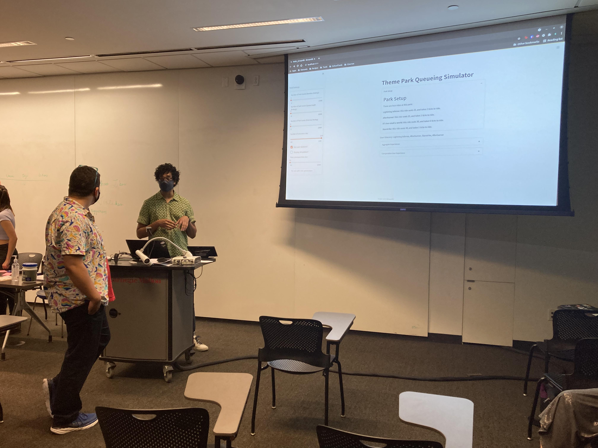

[Link to google doc](https://docs.google.com/document/d/19LBNmNIz-2mKWfcSyZB_hAvp05hnZ4awjApvx9uYm7Q/edit)


# Queing Simulator Writeup

For our first class project, we were tasked with prototyping ways for guests to avoid unpredictably long queues, in a way that "feels fair" to guests. Our team decided to focus on two complementary approaches: in-person experience prototypes to study questions related to individual experience in particular scenarios, and a simulator (this project) that simulated a park in which those scenarios could be played out at scale. These prototypes could be seen as being input for each other: experience prototypes can inform what scenarios to extrapolate to the behavior of an entire park, and emergent behavior in a simulation can inform what would be useful to experience prototype. The code for the simulator can be found [here](https://github.com/gsireesh/pax_queueing)

The intent behind the simulator was to provide a way to study the statistics of large numbers of guest experiences in a way that would be difficult to do with real people, with and without the interventions that our team's other prototypes proposed. We ended up implementing the itinerary strategy for guests, and allowing users of the simulation to alter the proportion of guests following the default strategy vs. the strategy that we were prototyping. In order to study the guest experiences, the simulator offered histograms of the metric we chose to proxy guest experiences: time spent on rides vs. waiting for them. We also allowed a user to specify a stand-in that "experienced" the simulation for them: the user could select any of the guest strategies, and finally compare their day against the day of a randomly chosen other guest. 

## Modeling Choices

We chose to model our hypothetical park as a collection of agents with customizable behavior in a park that consisted of a collection of attractions with varying characteristics. Time was modeled in "ticks", each of which represented five real-world minutes in a park that was open for twelve hours in a day. The park had a limited spatial component: it was "laid out" in a hub pattern, where each ride was linked to a central "liminal space", an area in between all of the rides. This also resulted in a topography where a user, when finished riding a ride, could spend one tick and return to the ride they just rode, or spend two ticks in transit to another ride. 

Attractions were specified by two parameters: the number of riders that they could take at once (the `capacity` attribute), and the number of ticks it took for one batch of riders to finish the ride (`duration_ticks`). We created a park with four different attractions: three short roller coasters, two with a higher capacity, and a slightly longer one, with a lower capacity, and a ride with high capacity that also took a long time. In future simulators, I'd pay more attention to the park setup: our rides ended up being very similar, and the emergent properties of queues based on ride qualities was highly chaotic.

We modeled guests as individual agents with customizable behavior, by defining a common base class that specified our default behavior, then allowing subclasses to override that default behavior. In practice, this meant that each subclass of `Guest` implements its own version of the `plan` method, which has access to global park information, in order to make its choices. We implemented three behaviors in this simulator:
- our default strategy, random choice, controlled by popularity: guests choose which rides to go on based on how popular they are
- opportunistic: guests choose to go to whichever queue is shortest. This results in interesting emergent properties: this type of guest tends to flock to rides that, by the time they get there, have already built up a sizable queue, resulting in an interesting sawtooth curve-like periodicity.
- Guests that behave as in some of our other prototypes: they are given an itinerary, and can either follow it to the letter, as in Roger's prototype, or can choose to make alterations with some probability, as in Yang's. 

The simulator runs through a "day" in the park with controllable duration, though by default, a day is 144 ticks, representing 12 hours in the park. Users of the prototype can select the proportion of users with each strategy in the park. As the day progresses, users will, using their `plan()` method, choose rides to wait for; rides will advance them through queues before letting them ride, finally depositing them in the liminal space, where the process begins anew. 

This structure provided some really interesting emergent properties to play with. It's unclear, however, if any of them were at all realistic. If I were to repeat this experiment, I'd love to design it more iteratively, working more collaboratively with my team to get a better sense of what was realistic vs not. I'd also love to be able to model a number of diferent things that I didn't have the time to do:
- better incorporation of ride popularity in the guest's choices
- better metrics for guest experience: did they get to all their rides? If not, what percentage of their must-see rides did they get to?
- seasonality in how crowded rides were: how would a simulated post-lunch rush influence the behavior of the system.

## Running the exercise
Our prototyping exercise had to begin with a bit more stage-setting than previous prototypes. Because the prototype presented both a bird's-eye view of a day at the park, and also provided controls to allow re-running of the simulation with a number of different parameters, we had to frame the audience of the prototype as designers who wanted to study potential user behavior in the park, rather than as users themselves. The tool was presented as prototype tool with which designers could themselves prototype system behavior in a park, potentially in connection with other experience prototyping activities that focus more on individual behavior. Below is a picture of the prototyping exercise we ran in the class:



We got a lot of interesting feedback for this concept in class. The most prominent theme in the feedback that we got revolved around how and when this would be useful to our imagined designer at the park. For instance, users in class pointed problems with the metric we chose to use to proxy user experience, the time spent on rides vs. waiting to ride. This metric allows for cases where longer rides (that don't necessarily provide a better UX) have an undue weight on the metrics collected at the end. To the question of when this would be useful, we also discussed how this tool could be used: how would designers usefully narrow the scope of the parameters to do rigorous, meaningful experiments? 

Another theme in our feedback was modeling choices, and the behaviors that the model did or did not incorporate. We discussed the choice to model individual user behavior (rather than, e.g. groups that would like to ride together), the simulation allowing the user to model different guest behaviors to see how they interacted, and how much ride popularity would impact any real theme park. 

## Notes for future exercises

I'd argue that this simulation provided a valuable complement to our other prototyping exercises: it provided a window into what would happen at the park level when individual behaviors are generalized: a useful tool to evaluate whether changes that are popular with individual users in an experience prototype could be scaled up to work across a broader timescale. 

If I were to build this simulator again, I think I'd spend a lot more time focusing on how to measure experience. While user reporting features were a key part of this prototype, the actual metrics that they generated were not very carefully considered. With more time, I'd also like to evaluate the choices of what to model both a little bit more carefully and collaboratively: getting feedback at intermediate points on whether to include ride popularity, or more accurate distances, or even real-time changes to the model would have probably made for a more robust final simulator.

## Resources used
This project used [streamlit](https://streamlit.io) to build the interactive frontend, [pandas](https://pandas.pydata.org) for convenience when analyzing data, and [plotly](https://pypi.org/project/plotly/) for the histogram charts. The backend of the simulation was built in pure Python.

## Running the project
Install requirements, ideally in a virtual environment:
```shell
pip install -r requirements.txt
```
Run the Streamlit interactive frontend:
```shell
streamlit run  main_streamlit.py
```